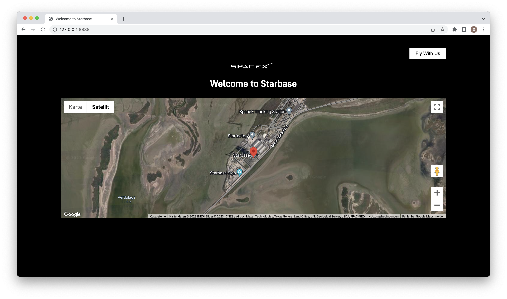

# Autopilot for Code
Autopilot for Code: ChatGPT can develop, set up, and run a complete web application.

## Video

## Artefacts
The artefacts generated by ChatGPT can be found in the [demo](demo) directory.